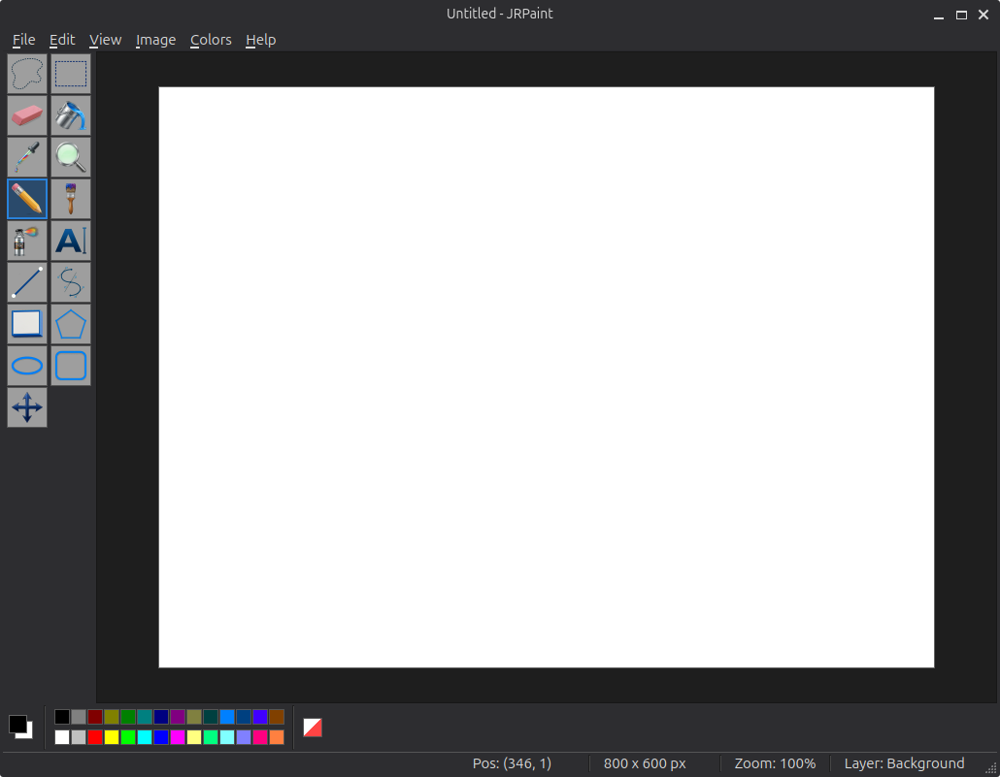
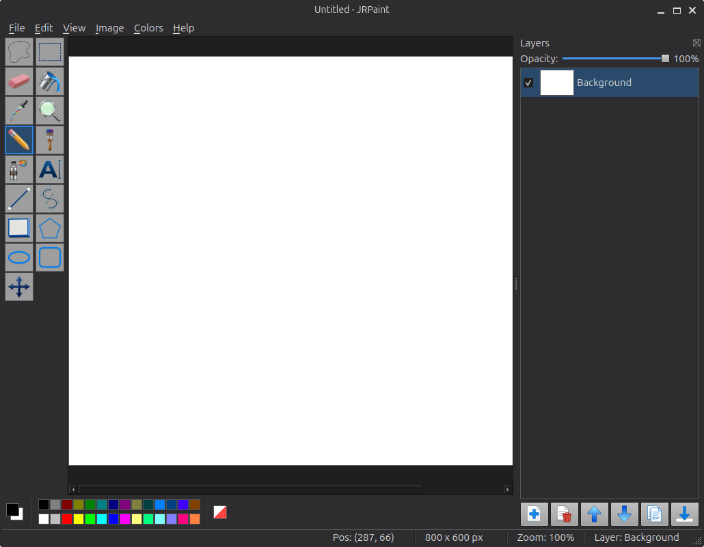

# JRPaint

A cross-platform desktop paint application inspired by classic Microsoft Paint, built with Python 3 and PyQt6.



## Features

- **Classic Feel, Modern Power**: Inspired by the pre-2017 Microsoft Paint UI.
- **Layer System**: Photoshop-style layers (add, delete, reorder, merge, duplicate, opacity, visibility).

- **Advanced Selection**: Lift-and-move pixels, resize with 8 handles, and rotate selections.
- **Transparency Support**: Alpha channel support and a dedicated transparent color swatch.
- **Tools**: 17 essential tools including Pencil, Brush, Airbrush, Text (inline editing), Shapes (Rectangle, Ellipse, Polygon, etc.), and more.
- **Dark Mode**: A sleek, modern dark UI theme.
- **Zoom**: Smooth trackpad pinch-to-zoom and traditional zoom controls.
- **File Formats**: Supports PNG, JPEG, BMP, and a custom layered `.jrp` format.

## Installation

### Dependencies
- **Python 3.10+**
- **PyQt6 >= 6.5**

Install PyQt6 using pip:
```bash
pip install PyQt6
```

## Running the Application

### From Source
```bash
python3 main.py
```

### From PAR File (Portable Archive)
If you have the `jrpaint.par` file (found in the `releases/` folder), you can run it directly:
```bash
python3 releases/jrpaint.par
```

## Project Structure
- `main.py`: Entry point and application setup.
- `jrpaint/`: Core application logic and resources.
- `gui_config.json`: Theme and icon configuration.
- `releases/`: Contains the pre-packaged portable executable (`jrpaint.par`).

## License
This project is licensed under the MIT License - see the [LICENSE](LICENSE) file for details.
